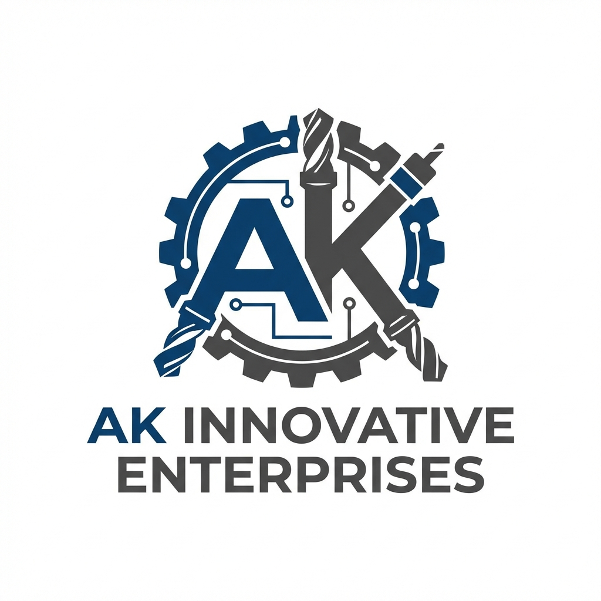

# AK INNOVATIVE ENTERPRISES - B2B Manufacturing Website



## 🏭 About

Professional B2B manufacturing website for **AK INNOVATIVE ENTERPRISES**, showcasing precision machining capabilities, CNC job work services, and engineering excellence.

## ✨ Features

- **Modern Industrial Design**: Clean, professional aesthetic with blue and dark grey color scheme
- **Fully Responsive**: Mobile-first design optimized for all devices
- **SEO Optimized**: Complete meta tags, sitemap, and robots.txt
- **Contact Form Integration**: Google Sheets integration with email notifications
- **Smooth Animations**: Scroll-based animations and interactive effects
- **Performance Optimized**: Lightweight vanilla JavaScript, optimized images

## 📁 Project Structure

```
ak_innovative_website/
├── public/
│   ├── index.html          # Home page
│   ├── about.html          # About us page
│   ├── capabilities.html   # Machinery & capabilities
│   ├── contact.html        # Contact form
│   ├── sitemap.xml         # SEO sitemap
│   └── robots.txt          # Search engine instructions
├── src/
│   ├── css/
│   │   ├── main.css        # Design system & utilities
│   │   └── components.css  # UI components
│   ├── js/
│   │   ├── main.js         # Navigation & form handling
│   │   └── animation.js    # Scroll animations
│   └── assets/
│       └── images/         # Logo, machinery, components
├── SETUP_INSTRUCTIONS.md   # Detailed setup guide
└── README.md              # This file
```

## 🚀 Quick Start

### Local Development

1. **Clone or download** this repository
2. **Open** `public/index.html` in your web browser
3. **Navigate** through all pages to test functionality

### Setup Contact Form

The contact form requires Google Sheets integration. See [SETUP_INSTRUCTIONS.md](SETUP_INSTRUCTIONS.md) for detailed steps:

1. Create a Google Sheet
2. Set up Google Apps Script
3. Deploy as Web App
4. Update the script URL in `src/js/main.js`

## 🌐 Deployment

### Option 1: Netlify (Recommended)

1. Sign up at [Netlify](https://www.netlify.com/)
2. Drag and drop the `public` folder
3. Configure custom domain
4. Done! ✅

### Option 2: GitHub Pages

1. Create a GitHub repository
2. Upload files from `public` folder
3. Enable GitHub Pages in Settings
4. Your site is live!

### Option 3: Traditional Hosting

1. Get web hosting (Hostinger, Bluehost, etc.)
2. Upload via FTP
3. Configure domain
4. Live! 🎉

## 📄 Pages

- **Home** (`index.html`): Hero section, why choose us, services, clients
- **About Us** (`about.html`): Company overview, leadership, mission & values
- **Capabilities** (`capabilities.html`): Machinery specifications, quality control
- **Contact** (`contact.html`): Contact form, company details, location map

## 🎨 Customization

### Update Colors

Edit CSS custom properties in `src/css/main.css`:

```css
:root {
  --color-accent: #0066cc;        /* Change primary blue */
  --color-accent-dark: #004999;   /* Change dark blue */
  /* ... more colors */
}
```

### Update Company Information

- Contact details: Edit footer in all HTML files
- Business hours: Edit `contact.html`
- Email: Update in Google Apps Script and HTML files

### Add More Machinery

1. Add images to `src/assets/images/machinery/`
2. Edit `capabilities.html`
3. Follow existing card pattern

## 🛠️ Technologies Used

- **HTML5**: Semantic markup
- **CSS3**: Modern styling with custom properties
- **Vanilla JavaScript**: No frameworks, lightweight
- **Google Fonts**: Inter font family
- **Google Apps Script**: Form backend integration

## 📊 Performance

- Target Lighthouse Score: **90+**
- Mobile-first responsive design
- Optimized images and assets
- Minimal JavaScript for fast loading

## 📞 Contact

**AK INNOVATIVE ENTERPRISES**
- Address: Road No.17, Holkarwadi, Tal-Haveli, Dist-Pune – 412308
- Contact Person: Mr. Abhishek Kalbhor
- Phone: +91 9588622951
- Email: thebadhe3p@gmail.com

## 📝 License

© 2026 AK INNOVATIVE ENTERPRISES. All rights reserved.

---

**Need Help?** Check [SETUP_INSTRUCTIONS.md](SETUP_INSTRUCTIONS.md) for detailed setup guides and troubleshooting.
